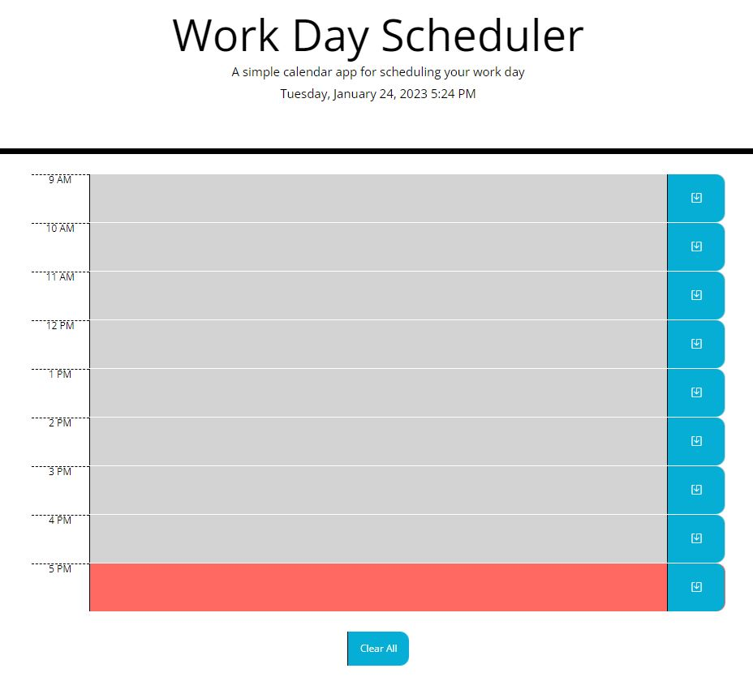
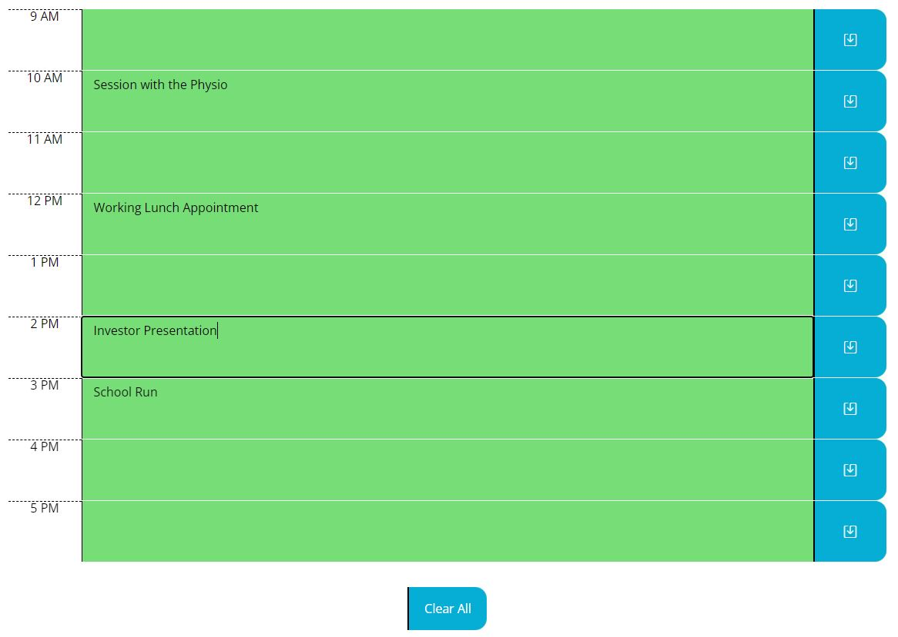

# Workday Hourly Diary

## Description

This project involved creating a simple workday calendar application which allows the user to get organised by saving entries on an hourly basis.

The application is expected to show the current date and time at the top of the webpage when the user opens the calendar.

It should also display timeblocks for standard work hours. These will be colour-coded based on whether they are in the past, present or future, and will allow the user to make a diary entry when clicked. The information inputted by the user should remain on the page when refreshed

The application was created to run in the browser, powered by jQuery, featuring dynamically updated HTML and CSS and incorporating the Moment.js library to work with date and time.

## Installation

The application, linked below, was deployed using GitHub Pages. 

Simply upload the index.html and license.txt files, along with the assets folder which contains the JS, CSS and image folders and files, to the desired webserver.

## Usage

[Link to the deployed Workday Hourly Diary application on GitHub Pages](https://ccmong.github.io/workday-hourly-diary/)

[Link to the GitHub code repository](https://github.com/CcMong/workday-hourly-diary)

Time blocks that are in the past are grey, and in the future are green. The time block corresponding to the present hour is orange.

When the user runs the application, they can click in the text area and make entries to plan their day.

Once the user makes an entry within a time block, they can save it by clicking the corresponding save button. The entry will remain until the user overwrites it with another entry, or until the "Clear All" button at the bottom is clicked - which will clear all timeblocks simultaneously.

## Credits  

N/A

## License

MIT License.

Please refer to the LICENSE in the repo.

## Badges

